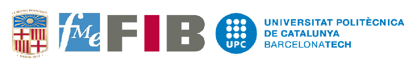

| The Team |
|:-----------:|
|We are a group of Academicians, Data Scientists, Mathematicians, Statisticians, Psychologists, Criminologists, Software Developers, Forensic Experts, Lawyers etc on a mission to save the world from the emerging threat of terrorism by using the tools from the domain of Artifical Intelligence|

| What are the objectives of this study? |
|:-----------:|
|We are trying to measure uniquely the fingerprints of the extremist outfits operating in the south asian region by means of tools from the domain of Artificial Intelligence. Our objectives are not only aimed at using machine intelligence for understanding the unique set of characteristics that an extremist outfit possesses while it conducts its operations but also at interpreting the reasons behind the suspected involvement of such an extremist outfit and identfying the top factors that help the machine to arrive at a conclusion that involves that outfit using interpretibility mechanisms developed to explain the decisions made by such machines. Eventually, this counter intelligence engine, augmented with more advanced tools in future can help the user of the system to arrive at a decision faster than ever before with accurate and logical reasoning.|

| Collaborators |
|:-----------:|
||
